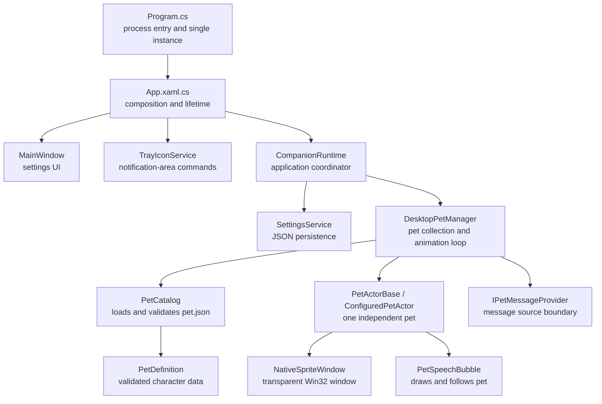
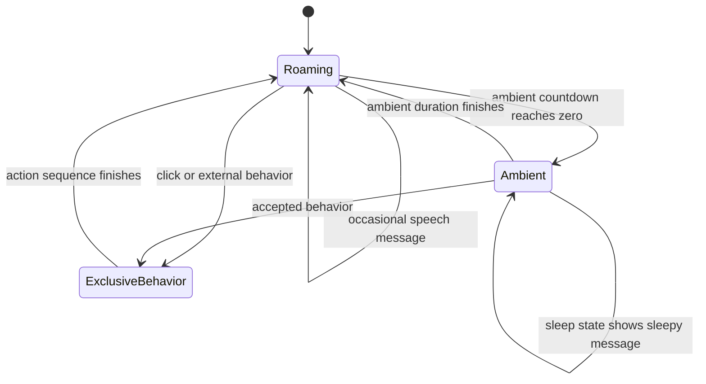
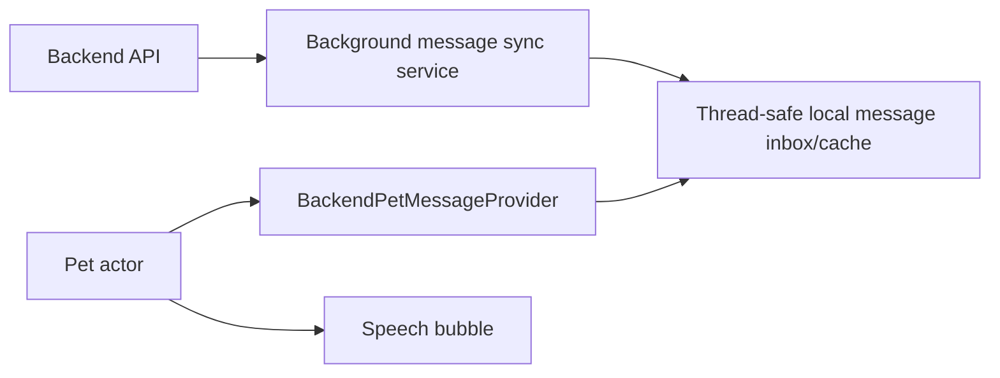

# Hello Companion architecture and study guide

This document explains how Hello Companion is structured, why the main pieces exist,
and how to extend the project safely. It describes the current application: desktop
pets move around the taskbar or screen, enter ambient animation states, and display
local activity-aware messages. The old scheduled “Hello” feature is no longer active.

## 1. Technology overview

Hello Companion is a Windows desktop application built with:

- C# and .NET 10
- WinUI 3 for the settings window
- Windows App SDK for application infrastructure
- Win32 interop for the tray icon and transparent overlay windows
- `System.Drawing` for loading sprites and drawing speech bubbles
- JSON for settings and custom pet definitions

The project targets x64 and ARM64. The main project is
`src/HelloCompanion.App/Companion.csproj`.

## 2. Architecture at a glance

The application uses a small layered architecture. UI code does not directly animate
pets, and rendering code does not directly save settings.



The dependency direction is mostly downward: high-level application objects own and
call lower-level services. Lower-level rendering classes do not know about the main
window or settings screen.

## 3. Startup and application lifetime

### `Program.cs`

`Program.Main` is the real process entry point. The project disables WinUI's generated
entry point with `DISABLE_XAML_GENERATED_MAIN`, allowing the application to control
single-instance behavior before WinUI starts.

The important concepts are:

1. A named `Mutex` allows only one main instance of the application.
2. A named `EventWaitHandle` lets a second launch signal the existing instance.
3. A background task waits for that signal.
4. The signal is dispatched to the UI thread, where the existing window is shown.
5. `Application.Start` creates the WinUI application and its dispatcher queue.

The dispatcher is important because Windows UI objects generally have thread affinity:
they must be accessed from the thread that created them.

### `App.xaml.cs`

`App.OnLaunched` is the composition root. A composition root is the one place where
dependencies are constructed and connected.

It creates:

- `PetCatalog`
- `DesktopPetManager`
- `SettingsService`
- `CompanionRuntime`
- `MainWindow`
- `TrayIconService`

Keeping construction here makes dependencies visible. It also makes future replacement
easy. For example, `DesktopPetManager` currently receives a
`LocalPetMessageProvider`, by default, but it can later receive another implementation.

When the user closes the settings window, the app normally hides it instead of exiting.
`ExitApplication` is the explicit shutdown path. It disposes the tray icon, runtime,
pets, native windows, bitmaps, and cancellation objects before closing WinUI.

## 4. UI, runtime, and state changes

### `MainWindow.xaml` and `MainWindow.xaml.cs`

`MainWindow.xaml` declares layout and controls. Its code-behind:

- copies saved settings into controls;
- converts control values into application values;
- calls methods on `CompanionRuntime`;
- refreshes status text when runtime state changes;
- implements close-to-tray behavior.

The window does not construct pets or write JSON directly. This separation prevents UI
details from leaking into application logic.

The code-behind implements `INotifyPropertyChanged`. Properties such as `StatusTitle`
are bound using `x:Bind`. Calling `PropertyChanged` tells WinUI that a displayed value
has changed.

### `CompanionRuntime.cs`

`CompanionRuntime` is a facade over the application services. A facade gives the UI a
small, convenient API instead of making it coordinate several subsystems.

Its current responsibilities are:

- loading settings during startup;
- applying pet visibility, selected character IDs, and movement area;
- applying the allowed ambient-animation selection;
- saving changed settings;
- opening the custom-pet folder;
- forwarding pet-manager errors and state changes;
- disposing owned runtime services.

The event flow is:

```text
DesktopPetManager.StateChanged
    -> CompanionRuntime.StateChanged
    -> MainWindow.RefreshStatus
    -> bound UI text is updated
```

This is a simple observer pattern. The event producer does not need to know which UI
controls are listening.

## 5. Settings persistence

### `CompanionSettings.cs`

`CompanionSettings` is an immutable C# record. Updates use a `with` expression:

```csharp
_settings = (_settings with
{
    DesktopPetsEnabled = enabled,
    SelectedPetIds = selectedPetIds
}).Normalize();
```

Immutability makes it harder to accidentally leave a shared settings object partially
updated. `Normalize` clamps numeric values and replaces invalid enum-like strings with
safe defaults.

The record still contains old greeting properties so existing settings files remain
readable. They are not used by the current runtime and can be removed in a deliberate
settings-schema migration later.

### `SettingsService.cs`

Settings are stored at:

```text
%LOCALAPPDATA%\HelloCompanion\settings.json
```

Saving uses a temporary file followed by replacement. This reduces the chance of
leaving a half-written settings file if the process stops during serialization.

Loading returns defaults when the file is absent, malformed, inaccessible, or cannot
be read. A desktop companion should continue running even when preferences are damaged.

## 6. Character definitions and loading

### `PetDefinition.cs`

`PetDefinition` is the in-memory representation of `pet.json`. It contains:

- identity and display name;
- animation names and PNG frame paths;
- activity-specific character messages;
- frame timing and looping information;
- sprite dimensions and movement speed;
- weighted ambient behaviors;
- optional declarative click and reminder actions.

The JSON manifest separates character data from engine code. A new character can be
added without creating a new C# class.

### `PetCatalog.cs`

`PetCatalog.Load` searches two locations:

1. built-in pets under the installed `Assets/Pets` directory;
2. user pets under `%LOCALAPPDATA%\HelloCompanion\Pets`.

Definitions are grouped by ID, and the last definition wins. Because custom pets are
loaded after built-ins, a custom definition can override a built-in character with the
same ID.

The catalog is also a trust boundary. It validates and clamps untrusted manifest data:

- frame paths must remain inside the character folder;
- frames must exist and use the `.png` extension;
- dimensions, speeds, and durations are bounded;
- invalid animation references are removed;
- one malformed character does not prevent other characters from loading.

Custom manifests describe actions; they cannot execute arbitrary code. This is an
important security property to preserve.

## 7. Pet manager and animation loop

### `DesktopPetManager.cs`

`DesktopPetManager` owns the active collection of `IPetActor` objects. When settings
are applied, it:

1. stops and disposes existing pets;
2. reloads the catalog;
3. selects taskbar or full-screen movement;
4. resolves the selected character IDs and creates one actor for each selection;
5. starts a `DispatcherQueueTimer`.

The timer runs approximately every 33 milliseconds, or about 30 frames per second.
It calculates elapsed time using `Stopwatch.GetTimestamp` and passes delta time to each
pet:

```csharp
pet.Update(elapsedSeconds);
```

Movement uses elapsed seconds rather than “pixels per frame.” This is called
frame-rate-independent movement:

```text
new position = old position + velocity * elapsed seconds
```

If a frame is delayed, the pet travels the correct distance instead of permanently
slowing down. The elapsed value is clamped to prevent a long pause or debugger stop
from causing a huge jump.

Each visible pet is a separate actor with independent position, velocity, animation,
ambient timing, message timing, and busy state.

The settings window displays every validated catalog entry in a multi-select list.
Selections are stored by stable pet ID rather than display name. The tray menu builds a
checked command for each available character; choosing one updates the same persisted
ID collection. The old numeric pet count remains only as a migration fallback for
settings files created before character selection was introduced.

The manager also exposes `roam` plus the union of animation names declared by all
ambient behaviors. The settings window presents these in a second multi-select list. A
`null` saved ambient selection means “all ambient animations” for backward
compatibility, while an empty list means “disable all random ambient animations.” Each
actor filters its own manifest behaviors using the selected names, so enabling `jump`
is harmless for a custom pet that does not provide a jump animation.

Roaming has its own persisted flag. When it is cleared, position updates remain paused
and the actor uses `idle` as its resting animation (falling back to `roam` if no idle
clip exists). Enabled ambient animations such as sleep and jump still run at the normal
random intervals, after which the actor returns to the same stationary pose. Manual
sleep mode remains an override regardless of these selections.

## 8. The pet actor state machine

### `IPetActor.cs`

`IPetActor` defines what the manager needs from any pet implementation: identity,
update, behaviors, pause/resume, busy status, and disposal. The manager therefore
depends on an interface instead of one concrete actor class.

### `PetActorBase.cs`

`PetActorBase` contains the shared mechanics:

- position and velocity;
- taskbar and full-screen boundary handling;
- sprite frame selection;
- horizontal sprite flipping;
- ambient behavior selection;
- message timing;
- manual sleep mode;
- speech-bubble anchoring;
- click and reminder exclusivity;
- native resource cleanup.

`ConfiguredPetActor` adds behavior execution based on the actions declared in
`pet.json`.

The actor has several related state variables rather than one formal enum. Conceptually,
its normal lifecycle is:



### Ambient behavior

Every 7–15 seconds, an ambient behavior is chosen from the character manifest. The
choice is weighted. If `idle` has weight 3 and `sleep` has weight 1, the approximate
selection probability is:

```text
idle  = 3 / (3 + 1) = 75%
sleep = 1 / (3 + 1) = 25%
```

When more than one behavior is enabled, the actor excludes the behavior that just
played from the next choice. This prevents a high-weight animation such as idle from
repeating indefinitely and makes every selected alternative easier to observe while
retaining weighted choice among the remaining candidates.

The chosen behavior pauses movement, plays its animation for a random duration inside
the manifest's range, then resumes roaming. Entering the `sleep` animation asks the
message provider for a sleep message.

### Periodic roaming messages

Each actor has a separate randomized message countdown of 25–50 seconds. When the pet
is roaming and no bubble is already visible, it asks the message provider for a roaming
message. The bubble stays visible for four seconds.

Randomized timing prevents multiple pets from speaking in perfect synchronization and
makes the behavior feel less mechanical.

### Sleep mode

Sleep mode is a persisted manual toggle. Applying settings passes its value from
`CompanionRuntime` to `DesktopPetManager`, which calls `SetSleepMode` on every newly
created actor.

While sleep mode is enabled, each pet pauses movement, ignores clicks, and continuously
uses its sleep animation. Gentle sleep messages may still appear at a slower randomized
interval of 45–90 seconds. Turning sleep mode off resumes normal roaming and resets the
message countdown. There is no time-of-day schedule.

### Exclusive behaviors

`SemaphoreSlim` ensures that only one click/reminder behavior runs on an actor at a
time. `IsBusy` prevents ambient state changes during that behavior. A cancellation token
stops in-progress behavior when pets are reloaded or the application exits.

This illustrates three concurrency concepts:

- mutual exclusion: one behavior owns the actor at a time;
- cancellation: shutdown does not wait for every delay to finish;
- cleanup in `finally`: the bubble hides and movement resumes even after failure.

## 9. Sprite animation and movement

Animation frames are loaded once into `AnimationClip` objects. Each clip stores right-
facing and left-facing versions, its frame duration, and whether it loops.

The displayed frame is calculated from accumulated animation time:

```text
elapsed frame = animation time in milliseconds / frame duration
looping index = elapsed frame modulo number of frames
```

For a non-looping animation, the index is clamped to the final frame.

### Taskbar movement

`DesktopGeometry` asks Windows for taskbar placement. A pet moves along the taskbar's
long axis and reverses velocity when it reaches an edge. The same code accounts for
taskbars docked on the top, bottom, left, or right.

### Full-screen movement

In full-screen mode, both X and Y positions change. When the sprite reaches a virtual-
screen boundary, the matching velocity component changes sign, producing a bounce.
The virtual screen includes all monitors as one coordinate space.

## 10. Native transparent windows

### `NativeSpriteWindow.cs`

WinUI controls are not used for each pet. Instead, every pet is drawn in a borderless
Win32 layered window. This provides per-pixel transparency: transparent pixels in a PNG
remain transparent on the desktop.

Important native concepts include:

- a window handle (`HWND`) identifies a native window;
- a device context is a native drawing surface;
- a DIB section stores 32-bit pixel data;
- `UpdateLayeredWindow` updates pixels and screen position together;
- `WS_EX_NOACTIVATE` prevents the pet from stealing keyboard focus;
- `WS_EX_TRANSPARENT` makes non-clickable pets pass mouse input through;
- `ShowWindow` displays or hides the overlay without activating it.

`LayeredSpriteFrame` converts a managed `Bitmap` into a native bitmap handle. Because
native handles are unmanaged resources, both frame and window classes implement
`IDisposable`.

Whenever code owns an `IDisposable`, ask: “Who disposes it, and when?” In this project,
ownership forms a chain:

```text
App -> CompanionRuntime -> DesktopPetManager -> PetActorBase
    -> NativeSpriteWindow / PetSpeechBubble / animation frames
```

## 11. Speech bubbles and anchoring

### `PetSpeechBubble.cs`

A speech bubble is drawn into a transparent bitmap using `System.Drawing`. It is then
shown through its own `NativeSpriteWindow`.

The position is calculated from `PetScreenBounds`:

- center the bubble horizontally over the sprite;
- normally place it above the sprite;
- place it below when there is insufficient room above;
- clamp it to the virtual screen so it remains visible.

The actor calls `UpdatePosition` every animation tick while the bubble is visible. This
is necessary because the pet's screen coordinates change continuously. Drawing the
bubble only once would leave it stuck at its original screen position.

The bitmap itself is reused while following the pet. Only the native window position is
updated, which is cheaper than redrawing text 30 times per second.

## 12. Message-provider boundary

### `PetMessageProvider.cs`

`IPetMessageProvider` separates the question “what should the pet say?” from “how does
the pet display it?” Each request contains the pet ID, display name, activity, and any
validated character messages from `pet.json`. The current `LocalPetMessageProvider`
prefers those character messages and otherwise returns:

- “I am feeling sleepy...” for sleep;
- one random friendly line for roaming.

The actor only knows the interface. This is dependency inversion: high-level behavior
depends on an abstraction, allowing the data source to change.

The current method is synchronous because local lookup is immediate:

```csharp
string? GetMessage(PetMessageRequest request, Random random);
```

### Future backend design

Do not perform an HTTP request inside `PetActorBase.Update`. That method runs on the UI
thread about 30 times per second. Network work there would freeze animation and could
make the whole app unresponsive.

A better backend architecture is:



Recommended responsibilities:

- `MessageSyncService`: periodically fetches messages using `HttpClient` away from the
  animation loop.
- `MessageInbox`: stores available messages and tracks which ones were consumed.
- `BackendPetMessageProvider`: immediately returns the next cached message or a local
  fallback.
- Backend API: stores message text, target pet/user, activity/context, priority,
  availability time, expiry time, and delivery status.

A useful initial API model might be:

```json
{
  "id": "msg_123",
  "text": "Time for a glass of water!",
  "activity": "roam",
  "priority": 10,
  "availableAfter": "2026-08-16T12:00:00Z",
  "expiresAt": "2026-08-16T18:00:00Z"
}
```

Add authentication, retry/backoff, offline fallback, timeouts, and explicit privacy
controls before relying on network-delivered messages.

## 13. Tray icon

`TrayIconService` uses Win32 because the tray icon is outside the WinUI window. It:

- creates a hidden native window to receive tray messages;
- registers an icon with `Shell_NotifyIcon`;
- builds a popup menu for Open, Show/Hide pets, and Exit;
- converts selected commands into .NET events;
- removes the tray icon during disposal.

The service raises events instead of calling `App` directly. This keeps the native
adapter reusable and prevents it from owning application policy.

## 14. Error handling strategy

The app favors graceful degradation:

- malformed settings produce defaults;
- a broken custom pet does not block valid pets;
- missing characters produce a status error;
- rendering failures stop pets instead of crashing the process;
- tray creation failure leaves the settings window available;
- settings-save failure keeps current choices active for the process lifetime.

Errors that can be handled locally are caught near the failing boundary. Broad
unexpected exceptions are generally allowed to surface during development rather than
being silently hidden.

## 15. How to trace common flows

### Application startup

```text
Program.Main
  -> App.OnLaunched
  -> CompanionRuntime.InitializeAsync
  -> SettingsService.LoadAsync
  -> DesktopPetManager.Apply
  -> PetCatalog.Load
  -> ConfiguredPetActor constructors
  -> animation timer starts
```

### Applying pet settings

```text
SavePets_Click
  -> CompanionRuntime.ApplyPetsAsync
  -> SettingsService.SaveAsync
  -> DesktopPetManager.Apply
  -> old actors disposed
  -> new actors created
  -> StateChanged events refresh the UI
```

### Showing a roaming message

```text
animation timer tick
  -> PetActorBase.Update
  -> UpdateAmbientMessage
  -> IPetMessageProvider.GetMessage("roam")
  -> PetSpeechBubble.Show
  -> every following tick calls PetSpeechBubble.UpdatePosition
  -> visible timer expires
  -> PetSpeechBubble.Hide
```

### Entering sleep

```text
ambient countdown expires
  -> weighted behavior selection chooses "sleep"
  -> movement pauses
  -> sleep animation starts
  -> IPetMessageProvider.GetMessage("sleep")
  -> sleepy bubble appears
  -> ambient duration expires
  -> pet resumes roaming
```

## 16. Where to make common changes

| Goal | Primary file |
| --- | --- |
| Change local message text | `Services/PetMessageProvider.cs` |
| Give a character custom dialogue | its `pet.json` `messages` section |
| Change roaming message timing | `Services/PetActorBase.cs` |
| Change sleep-mode behavior | `Models/CompanionSettings.cs`, `Services/DesktopPetManager.cs`, and `Services/PetActorBase.cs` |
| Change ambient-animation selection | `MainWindow.xaml`, `Models/CompanionSettings.cs`, and `Services/PetActorBase.cs` |
| Change bubble size, font, or colors | `Services/PetSpeechBubble.cs` |
| Change movement or collision behavior | `Services/PetActorBase.cs` |
| Change animation timer rate | `Services/DesktopPetManager.cs` |
| Add a manifest property | `Models/PetDefinition.cs` and `Services/PetCatalog.cs` |
| Add or edit a built-in character | `Assets/Pets/<Character>/pet.json` |
| Change character selection UI | `MainWindow.xaml`, `MainWindow.xaml.cs`, and `Services/TrayIconService.cs` |
| Change saved settings | `Models/CompanionSettings.cs` and `SettingsService.cs` |
| Change tray commands | `Services/TrayIconService.cs` and `App.xaml.cs` |
| Add backend messages | new sync/inbox services plus `IPetMessageProvider` implementation |

## 17. Suggested study exercises

Work through these in order and build after each change:

1. Add three roaming messages to a character's `pet.json`.
2. Change the roaming message range from 25–50 seconds to 45–90 seconds.
3. Add a separate message for the `idle` animation.
4. Add a user setting that enables or disables speech bubbles.
5. Add a manifest `messages` section so each custom pet can have its own lines.
6. Write unit tests for weighted behavior selection and settings normalization.
7. Extract position calculation into a testable movement component.
8. Implement an in-memory `MessageInbox` before connecting any network API.
9. Implement a fake backend provider and inject it from `App.OnLaunched`.
10. Add an HTTP sync service with cancellation, timeout, retry/backoff, and offline
    fallback.

The most valuable refactoring exercise is separating the actor's state into explicit
components: movement, animation, ambient behavior, and speech. `PetActorBase` currently
owns all four, which is understandable at this size but will become harder to test as
new behaviors are added.

## 18. Build and debugging

Build the common Windows target with:

```powershell
dotnet build Companion.sln -p:Platform=x64
```

Useful debugging locations:

- put a breakpoint in `DesktopPetManager.AnimationTimer_Tick` to inspect delta time;
- inspect `_x`, `_y`, `_velocityX`, and `_velocityY` in `PetActorBase`;
- inspect `_currentAnimation` and `_ambientBehaviorActive` for state transitions;
- inspect `_messageCountdownSeconds` and `_messageVisibleSeconds` for speech timing;
- put a breakpoint in `PetSpeechBubble.UpdatePosition` to verify anchoring;
- inspect `PetCatalog.Load` when a custom manifest is skipped.

Avoid pausing for a long time inside the render loop and then judging movement behavior:
the elapsed-time clamp intentionally treats long debugger pauses as at most 0.1 seconds.

## 19. Design principles to preserve

As the project grows, preserve these boundaries:

- The animation loop must stay fast and must never wait for disk or network I/O.
- UI controls should call the runtime rather than manipulate actors directly.
- Character packages should remain declarative and unable to execute arbitrary code.
- Every native handle, bitmap, timer, cancellation source, and event subscription needs
  an explicit owner and cleanup path.
- Backend failure should not stop movement; local messages should remain available.
- New behavior should be cancellable so pets can be hidden or reloaded immediately.
- Validate all settings, manifest content, and backend data at their boundaries.

Those principles matter more than any particular class name. They keep the companion
responsive, safe, testable, and ready for a backend without tying animation to network
availability.
